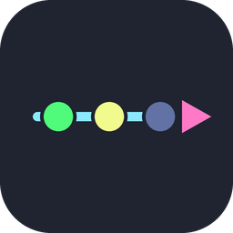
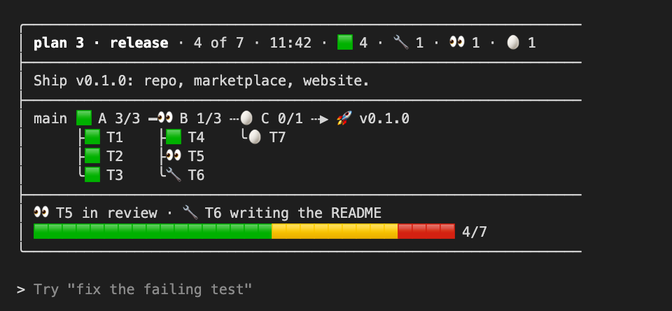

<p align="center"></p>

<h1 align="center">taskrail</h1>

<p align="center">
  <a href="https://github.com/drolosoft/taskrail/releases/latest"></a>
  <a href="https://opensource.org/licenses/MIT"></a>
  
</p>

> **🛤️ A live board of your session's plan, right above the prompt.**

taskrail is a Claude Code mod. When Claude works through a plan with several tasks, the board shows the waves, the tasks under each one and the state each task is in, updated by Claude itself as the work moves. You pick how much of it you see with `/taskrail`.

<p align="center"></p>

---

### Install

```bash
claude plugin marketplace add drolosoft/claude-plugins
claude plugin install taskrail@drolosoft-marketplace
```

Start a new session, or run `/reload-plugins`. `/plugin` then lists it as `1 mod active · taskrail`.

For one session with a local copy: `claude --plugin-dir ./taskrail`.

### Modes

| `/taskrail …` | What the band shows |
|---|---|
| `full` | The whole board: header, description, rail, tasks, key line and progress bar (the default) |
| `bar` | One line: project, plan, time, a station per wave, the goal and ten tiles |
| `both` | The whole board, and Claude also pastes it in the chat at every milestone |
| `off` | Nothing in the band; Claude shows the board in the chat only when you ask |

`/taskrail` alone answers the current mode. The choice is kept across sessions.

If you already have a skill or a command named `taskrail`, Claude Code keeps yours and refuses the mod's. The board and the three tools still work, in the mode last chosen; rename yours to get `/taskrail` back.

### How Claude uses it

The mod registers three tools. Claude calls them on its own when it runs a plan with several tasks; you can also ask for them by name.

| Tool | What it does |
|---|---|
| `plan` | Starts (or replaces) the board: project, title, goal, description and the waves with their task ids. Every task starts 🥚. |
| `set` | Updates task icons by id, the key line, the goal, the title or the description. Its result tells Claude what the current mode asks of the chat. |
| `show` | Returns the board as text, for the chat. |

Icons: 🥚 pending · 🔧 working · 👀 in review · 🩹 fixing · 🧪 testing · 🟩 merged · 🚀 shipped · 🔑 needs you · 👻 missing · 🧟 stale · 💥 broken · 🥱 idle · 🛑 stopped. The header counts each of these icons in use. A wave's station is 🟩 when every task is merged; otherwise it shows the most pressing state among its tasks, in this order: 🛑 🔑 💥 🧟 👻 🩹 👀 🧪 🔧 🚀, else 🥚. The "N of M" counts 🟩 only; the tiles are green for 🟩, yellow for the running states (🔧 👀 🩹 🧪, at least one tile while anything runs) and red for the rest. `plan` and `set` also take a `note`, the key line under the rail.

The plan lives in the session's plugin state and in the plugin store under the session id, so it survives `/resume`, including a restart of Claude Code followed by `--resume`. `/clear` drops the plan along with the conversation, and a new session starts with no plan.

### What it reads and writes

Nothing outside Claude Code. taskrail opens no network connection and reads or writes no file. It keeps the plan in the plugin's session state and in the plugin store, and draws it in the band above the prompt.

### Requirements

- Claude Code 2.1.287 or later.
- Works in the terminal, the IDE extensions and the desktop app's Code tab. Mods do not run in the VS Code chat panel, in `claude -p`, or in cloud sessions.

### Development

```bash
claude plugin validate --strict .
claude plugin test .
claude --plugin-dir .
```

Saving a file reloads the mod in a session started with `--plugin-dir`. Do not load the same mod from `--plugin-dir` and from the marketplace in one session: two plugins named `taskrail` would register the same tools twice.

### Contributing

See [CONTRIBUTING.md](CONTRIBUTING.md). Security reports go by email, see [SECURITY.md](SECURITY.md).

### License

MIT. Copyright (c) 2026 Drolosoft.
